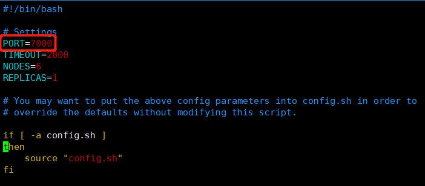

# 1、简要说明

2018年十月 Redis 发布了稳定版本的 5.0 版本，推出了各种新特性，其中一点是放弃 Ruby的集群方式，改为 使用 C语言编写的 redis-cli的方式，是集群的构建方式复杂度大大降低。关于集群的更新可以在 Redis5 的版本说明中看到，如下：

> The cluster manager was ported from Ruby (redis-trib.rb) to C code inside redis-cli. check `redis-cli --cluster help ` for more info.

可以查看Redis官网查看集群搭建方式，连接如下

https://redis.io/topics/cluster-tutorial

以下步骤是在一台 Linux 服务器上搭建有6个节点的 Redis集群。


# 2、创建集群步骤


## 1、创建目录

​        新建目录：/root/software/redis


## 2、下载源码并解压编译

```
wget http://download.redis.io/releases/redis-5.0.0.tar.gz
tar xzf redis-5.0.0.tar.gz
cd redis-5.0.0
make
```


## 3、创建6个Redis配置文件

​    6个配置文件不能在同一个目录，此处我们定义如下：

```
/root/software/redis/redis-cluster-conf/7001/redis.conf
/root/software/redis/redis-cluster-conf/7002/redis.conf
/root/software/redis/redis-cluster-conf/7003/redis.conf
/root/software/redis/redis-cluster-conf/7004/redis.conf
/root/software/redis/redis-cluster-conf/7005/redis.conf
/root/software/redis/redis-cluster-conf/7006/redis.conf
```

配置文件的内容为：

```
port 7001  #端口
cluster-enabled yes #启用集群模式
cluster-config-file nodes.conf
cluster-node-timeout 5000 #超时时间
appendonly yes
daemonize yes #后台运行
protected-mode no #非保护模式
pidfile  /var/run/redis_7001.pid
```

其中 port 和 pidfile 需要随着 文件夹的不同调增。


## 4、启动节点

```
/root/software/redis/redis-5.0.0/src/redis-server  /root/software/redis/redis-cluster-conf/7001/redis.conf
/root/software/redis/redis-5.0.0/src/redis-server  /root/software/redis/redis-cluster-conf/7002/redis.conf
/root/software/redis/redis-5.0.0/src/redis-server  /root/software/redis/redis-cluster-conf/7003/redis.conf
/root/software/redis/redis-5.0.0/src/redis-server  /root/software/redis/redis-cluster-conf/7004/redis.conf
/root/software/redis/redis-5.0.0/src/redis-server  /root/software/redis/redis-cluster-conf/7005/redis.conf
/root/software/redis/redis-5.0.0/src/redis-server  /root/software/redis/redis-cluster-conf/7006/redis.conf
```


## 5、启动集群

```
/root/software/redis/redis-5.0.0/src/redis-cli --cluster create 192.168.2.40:7001 192.168.2.40:7002 192.168.2.40:7003 192.168.2.40:7004 192.168.2.40:7005 192.168.2.40:7006 --cluster-replicas 1
```

启动后，可看到成功信息，如下：

```
>>> Performing hash slots allocation on 6 nodes...
Master[0] -> Slots 0 - 5460
Master[1] -> Slots 5461 - 10922
Master[2] -> Slots 10923 - 16383
Adding replica 192.168.2.40:7004 to 192.168.2.40:7001
Adding replica 192.168.2.40:7005 to 192.168.2.40:7002
Adding replica 192.168.2.40:7006 to 192.168.2.40:7003
>>> Trying to optimize slaves allocation for anti-affinity
[WARNING] Some slaves are in the same host as their master
M: 191c645200a8b4d267f71e3354c8248dbb533dde 192.168.2.40:7001
   slots:[0-5460] (5461 slots) master
M: 400a08d4e5a534c1b609988105d3e045395fbd12 192.168.2.40:7002
   slots:[5461-10922] (5462 slots) master
M: 684f6aa0fbccda295ce6818a8c01ee7255a7b002 192.168.2.40:7003
   slots:[10923-16383] (5461 slots) master
S: f2701549ae98315b432d73b49d139ee77d5685b4 192.168.2.40:7004
   replicates 684f6aa0fbccda295ce6818a8c01ee7255a7b002
S: 9fdc1e375436767ab815cbddd3df674f3bc2ca99 192.168.2.40:7005
   replicates 191c645200a8b4d267f71e3354c8248dbb533dde
S: e7742888ed85b37cff4a98e861e99bb16e8bae2c 192.168.2.40:7006
   replicates 400a08d4e5a534c1b609988105d3e045395fbd12
Can I set the above configuration? (type 'yes' to accept): yes
>>> Nodes configuration updated
>>> Assign a different config epoch to each node
>>> Sending CLUSTER MEET messages to join the cluster
Waiting for the cluster to join
....
>>> Performing Cluster Check (using node 192.168.2.40:7001)
M: 191c645200a8b4d267f71e3354c8248dbb533dde 192.168.2.40:7001
   slots:[0-5460] (5461 slots) master
   1 additional replica(s)
M: 684f6aa0fbccda295ce6818a8c01ee7255a7b002 192.168.2.40:7003
   slots:[10923-16383] (5461 slots) master
   1 additional replica(s)
S: 9fdc1e375436767ab815cbddd3df674f3bc2ca99 192.168.2.40:7005
   slots: (0 slots) slave
   replicates 191c645200a8b4d267f71e3354c8248dbb533dde
S: e7742888ed85b37cff4a98e861e99bb16e8bae2c 192.168.2.40:7006
   slots: (0 slots) slave
   replicates 400a08d4e5a534c1b609988105d3e045395fbd12
M: 400a08d4e5a534c1b609988105d3e045395fbd12 192.168.2.40:7002
   slots:[5461-10922] (5462 slots) master
   1 additional replica(s)
S: f2701549ae98315b432d73b49d139ee77d5685b4 192.168.2.40:7004
   slots: (0 slots) slave
   replicates 684f6aa0fbccda295ce6818a8c01ee7255a7b002
[OK] All nodes agree about slots configuration.
>>> Check for open slots...
>>> Check slots coverage...
[OK] All 16384 slots covered.
```

至此，Reids5 集群搭建完成。

3、集群其他操作

1、关闭集群

​    redis5 提供了关闭集群的工具，在如下目录：

/root/software/redis/redis-5.0.0/utils/create-cluster

   打开此文件修改端口为我们自己的，如下所示：

 



端口PROT设置为7000，NODES为6，工具会自动累加1 生成 7001-7006 六个节点 用于操作。

修改后，执行如下命令关闭集群：

```
/root/software/redis/redis-5.0.0/utils/create-cluster/create-cluster stop
```

2、重新启动集群

```
/root/software/redis/redis-5.0.0/utils/create-cluster/create-cluster start
```

3、使用脚本文件启动集群

```
#!/bin/sh
/root/software/redis/redis-5.0.0/src/redis-server  /root/software/redis/redis-cluster-conf/7001/redis.conf
/root/software/redis/redis-5.0.0/src/redis-server  /root/software/redis/redis-cluster-conf/7002/redis.conf
/root/software/redis/redis-5.0.0/src/redis-server  /root/software/redis/redis-cluster-conf/7003/redis.conf
/root/software/redis/redis-5.0.0/src/redis-server  /root/software/redis/redis-cluster-conf/7004/redis.conf
/root/software/redis/redis-5.0.0/src/redis-server  /root/software/redis/redis-cluster-conf/7005/redis.conf
/root/software/redis/redis-5.0.0/src/redis-server  /root/software/redis/redis-cluster-conf/7006/redis.conf

/root/software/redis/redis-5.0.0/src/redis-cli --cluster create 192.168.2.40:7001 192.168.2.40:7002 192.168.2.40:7003 192.168.2.40:7004 192.168.2.40:7005 192.168.2.40:7006 --cluster-replicas 1
```

 

以下是 Redis3 集群的操作步骤：