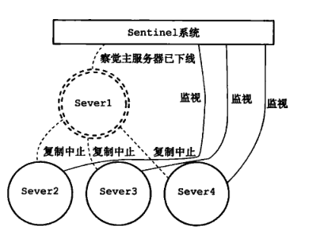
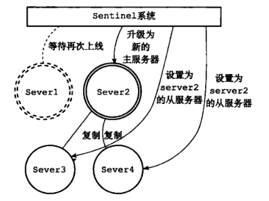

## 1、Sentinel 哨兵


Sentinel（哨兵）是Redis 的高可用性解决方案：由一个或多个Sentinel 实例 组成的Sentinel 系统可以监视任意多个主服务器，以及这些主服务器属下的所有从服务器，并在被监视的主服务器进入下线状态时，自动将下线主服务器属下的某个从服务器升级为新的主服务器。


在Server1 掉线后：



升级Server2 为新的主服务器：



### **一**、Sentinel的作用：

A、Master 状态监测

B、如果Master 异常，则会进行Master-slave 转换，将其中一个Slave作为Master，将之前的Master作为Slave 

C、Master-Slave切换后，master_redis.conf、slave_redis.conf和sentinel.conf的内容都会发生改变，即master_redis.conf中会多一行slaveof的配置，sentinel.conf的监控目标会随之调换 

 

 

### **二**、Sentinel的工作方式:

1)：每个Sentinel以每秒钟一次的频率向它所知的Master，Slave以及其他 Sentinel 实例发送一个 PING 命令 
2)：如果一个实例（instance）距离最后一次有效回复 PING 命令的时间超过 down-after-milliseconds 选项所指定的值， 则这个实例会被 Sentinel 标记为主观下线。 
3)：如果一个Master被标记为主观下线，则正在监视这个Master的所有 Sentinel 要以每秒一次的频率确认Master的确进入了主观下线状态。 
4)：当有足够数量的 Sentinel（大于等于配置文件指定的值）在指定的时间范围内确认Master的确进入了主观下线状态， 则Master会被标记为客观下线 
5)：在一般情况下， 每个 Sentinel 会以每 10 秒一次的频率向它已知的所有Master，Slave发送 INFO 命令 
6)：当Master被 Sentinel 标记为客观下线时，Sentinel 向下线的 Master 的所有 Slave 发送 INFO 命令的频率会从 10 秒一次改为每秒一次 
7)：若没有足够数量的 Sentinel 同意 Master 已经下线， Master 的客观下线状态就会被移除。 
若 Master 重新向 Sentinel 的 PING 命令返回有效回复， Master 的主观下线状态就会被移除。


### 三、配置方法

### 1、配置端口

　　　 在sentinel.conf 配置文件中， 我们可以找到port 属性，这里是用来设置sentinel 的端口，一般情况下，至少会需要三个哨兵对redis 进行监控，我们可以通过修改端口启动多个sentinel 服务。

```shell
# port <sentinel-port>
# The port that this sentinel instance will run on
port 26379
```

### 2、配置主服务器的ip 和端口

　　　我们把监听的端口修改成6380，并且加上权值为2，这里的权值，是用来计算我们需要将哪一台服务器升级升主服务器

```
# sentinel monitor <master-name> <ip> <redis-port> <quorum>
#
# Tells Sentinel to monitor this master, and to consider it in O_DOWN
# (Objectively Down) state only if at least <quorum> sentinels agree.
#
# Note that whatever is the ODOWN quorum, a Sentinel will require to
# be elected by the majority of the known Sentinels in order to
# start a failover, so no failover can be performed in minority.
#
# Slaves are auto-discovered, so you don't need to specify slaves in
# any way. Sentinel itself will rewrite this configuration file adding
# the slaves using additional configuration options.
# Also note that the configuration file is rewritten when a
# slave is promoted to master.
#
# Note: master name should not include special characters or spaces.
# The valid charset is A-z 0-9 and the three characters ".-_".
sentinel monitor mymaster 127.0.0.1 6380 2
```

### 3、启动Sentinel

```
/sentinel$ redis-sentinel sentinel.conf
```

sentinel 启动之后，就会监视到现在有一个主服务器，两个从服务器

 当我们把其中一个从服务器器关闭之后，我们可以看到日志：

```
10894:X 30 Dec 16:27:03.670 # +sdown slave 127.0.0.1:6381 127.0.0.1 6381 @ mymaster 127.0.0.1 6380
```

日志表示，6381这个从服务器已经从主服务器中脱离了出来，我们重新把6381 接回去。

```
10894:X 30 Dec 16:28:43.288 * +reboot slave 127.0.0.1:6381 127.0.0.1 6381 @ mymaster 127.0.0.1 6380
10894:X 30 Dec 16:28:43.365 # -sdown slave 127.0.0.1:6381 127.0.0.1 6381 @ mymaster 127.0.0.1 6380
```

### 4、关闭Master 

我们手动关闭Master 之后，sentinel 在监听master 确实是断线了之后，将会开始计算权值，然后重新分配主服务器

### 5、重连Master

　　如果master 重连之后，会不会抢回属于他的位置，答案是否定的，就比如你被一个小弟抢了你老大的位置，他肯给回你这个位置吗。因此当master 回来之后，他也只能当个小弟　　